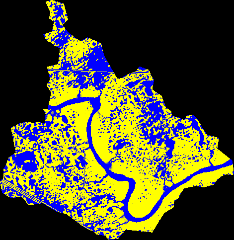

---
title: 'WDPM: the Wetland DEM Ponding Model'
tags:
  - C
  - Python
  - hydrology
  - Canadian Prairies
  - water distribution
  - connected fraction
authors:
  - name: Kevin Shook
    orcid: 0000-0003-0363-9929
    affiliation: 1
  - name: Raymond J. Spiteri
    orcid: 0000-0002-3513-6237
    affiliation: 2
  - name: John W Pomeroy
    affiliation: 1
affiliations:
 - name: Centre for Hydrology, University of Saskatchewan
   index: 1
 - name: Department of Computer Science, University of Saskatchewan
   index: 2
date: 03 May 2020
bibliography: paper.bib

# Summary

The hydrography of the Prairies of western North America, including Canada, is unusual in that the landscape is flat and recently formed due to the effects of pleistocene glaciation and a semi-arid climate since holocene deglaciation. Therefore, there has not been sufficient energy, time, or runoff water to carve typical dendritic surface water drainage networks in many locations. In these regions, runoff is often detended and sometimes stored by the millions of depressions (known locally as "potholes" or "sloughs") that cover the landscape. Conventional hydrological models are unable to simulate the spatial distribution of ponded water in Prairie basins dominated by depressional storage. When the depressions are filled, the detended water may overflow to another depression, though a process known as "fill and spill" [@spence:2003]. Therefore, the fraction of a depression-dominated Prairie basin that contributes flow to the outlet will change dynamically with the state of water storage within the basin. This situation is difficult to simulate with conventional hydrological models. 

# Program description

The WDPM was developed to solve the problems described above. The model distributes simulated water over a digital elevation model (DEM), which is an array of land surface elevations. The program has three modules:
- **add**, which adds specified depth of water to the DEM. Addition of water could be caused by rainfall, but in the Prairies it is more commonly due to snowmelt runoff.
- **subtract**, which subtracts a specified depth of water from the DEM. Subtraction of water may be due to infiltration to the soils, but in the Prairies it is more commonly caused by evaporation.
-  **drain**, which drains water from the lowest point in the DEM.

WDPM does not attempt to compute the magnitudes of the additive or subtractive fluxes, which must be established by measurement or through the use of a physically based model of Prairie hydrology such as the Cold Regions Hydrological Modelling platform (CRHM) [@pomeroyColdRegionsHydrological2007].

The  model output is the depth of water over each cell of the DEM.
 
All modules use the algorithm of @shapiroMAPCALCAlgebraGIS1992 redistribute the simulated water. This algorithm is iterative. In each iteration, the excess water, which is the depth of water required to be removed to make the surface flat, is computed for each DEM cell. As shown in \autoref{waterflow}, water can be distributed to a lower cell or to a higher cell with insufficient water. In each iteration, up one-eighth of available water can be distributed to any of the neighbouring cells. The algorithm is repeated until the water surface is flat, which is determined by the difference between successive values of the matrix every 1000 iterations. When the maximum cell difference is within a specified tolerance or the volume of water draining in 1000 iterations is smaller than a specified value, then the program terminates and the water depth is written to an ArcGIS .asc (ASCII) file.

.

The original version of WDPM was written by in Fortran [@shookMemoryEffectsDepressional2011] and parallelized using OpenMP. Because the program was so slow to run (taking hours or days to converge to a solution), it was decided to refactor the code. The program was converted to C, and an optional python GUI was added. Because the program is typically run by end-users on desktop computers, it was decided to use OpenCL to parallelise the code, as it permits the use of CPUs and/or GPUs. Using OpenCL, the matrix was subdivided as shown in \autoref{fig:opencl}, where each colour represents a separate thread. Because the matrix locations of each thread are separated by 3 rows and columns, the points are independent and race conditions are avoided. The refactoring of the WDPM was successful in greatly reducing execution time. 

.

# Examples

The WDPM is distributed with a sample DEM data set, which represents a small (~10 km^2^) sub-basin in southeastern Saskatchewan. The sub-basin (Smith Creek sub-basin 5) is described fully in @shookStorageDynamicsSimulations2013. The DEM measured 471 x 483 elements with a horizontal resolution of 10 m and a vertical precision of less than 1 mm.

In the first step, 300 mm of water was added, using the **add** module, distributed evenly over the basin. All of the water was allowed to run off. Prior to the addition of water, the basin was empty.  \autoref{fig:add} shows the extent of water (depths greater than 1 mm) resulting from the WDPM simulation. The accumulation of water in the depressions is clearly visible. Because the edge of the DEM acts like a dam, water in the stream channel is unable to leave the basin, causing it to back up. This unrealistic behaviour was the reason for the development of the **drain** module.

When the **drain** module was applied, the water in the stream channel was able to drain from the lowest point in basin, which is located at the basin outlet at the mouth of the stream. As shown in \autoref{fig:drain}, the resulting distribution of water is a more realistic representation of the state of the basin after the cessation of runoff. 

Following the addition and draining of water, 200 mm of water was removed using the **subtract** module. As shown in \autoref{fig:subtract}, the ponds are reduced in size, and many of the smaller ones have disappeared.

.

.

.

The WDPM is very computationally expensive, requiring many thousands or millions of iterations, particularly to drain water from the DEM (the addition and subtraction of water being less expensive). 
In the examples above, the addition of 300 mm of water, smoothed to a resolution of 100 mm, required 700 iterations. Draining the water to a tolerance of 0.1 mm/0.1 m^3^ required 332,000 iterations and took 981 s on a system with an Intel i7 (4 cores, 8 threads) running Linux. Removing the water and smoothing to a tolerance of 1 mm required 1,000 iterations - the minimum possible. 

Despite the computational cost, the program's great advantage is that it can simulate any storage state within a complex system of Prairie depressions.  This capability makes it useful for mapping the flooplains from non-riverine floods in the Canadian Prairies. The program outputs have been verified by remote sensing of recent floods in this region, and WDPM has been used to develop a simpler parametric model that is more easily incorporated in hydrological models [@shookStorageDynamicsSimulations2013]. The program's floodplain mapping capabiltiies
have made it useful for operational flood hazard mapping [@armstrongUSINGWETLANDPONDING2013a] in the Prairies by several government agencies and by private consultants.

# Licence
The WDPM is licensed under GPL 3.

# Acknowlegements

Funding for the refactoring of WDPM was provided by Agriculture and Agri-food Canada.

# References