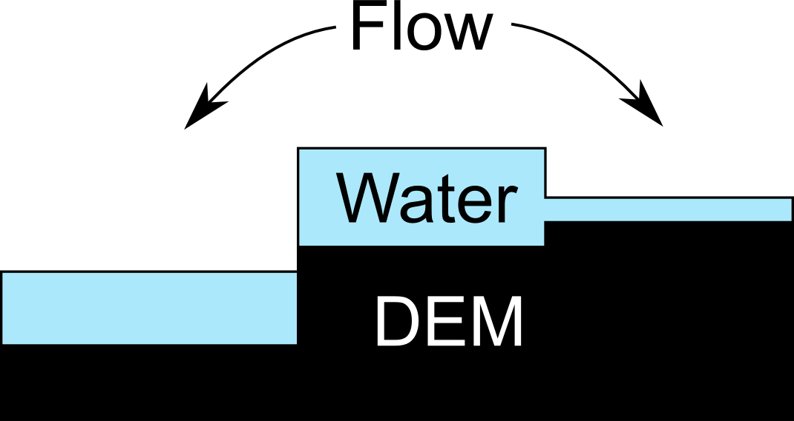
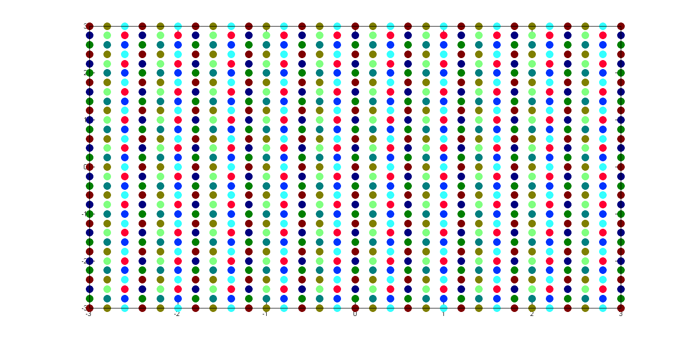
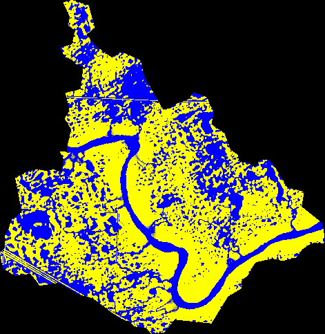
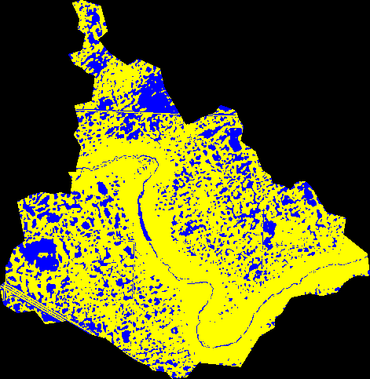
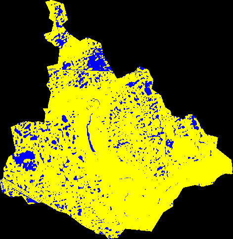

# Summary

The hydrography of the Canadian Prairies and adjacent northern US Great Plains is unusual in that the landscape is flat and recently formed due to the effects of pleistocene glaciation and a semi-arid climate since holocene deglaciation. Therefore, there has not been sufficient energy, time, or runoff water to carve typical dendritic surface water drainage networks in many locations. In these regions, runoff is often detented and sometimes stored by the millions of depressions (known locally as "potholes" or "sloughs") that cover the landscape. Conventional hydrological models are unable to simulate the spatial distribution of ponded water in prairie basins dominated by depressional storage. When the depressions are filled, the detended water may overflow to another depression, through a process known as "fill and spill" [@spenceHydrologySubarcticCanadian2003]. Therefore, the fraction of a depression-dominated prairie basin that contributes flow to the outlet changes dynamically with the state of water storage within the basin. This situation is difficult to simulate with conventional hydrological models.

# Program description

The WDPM was developed to solve the problems described above. The model distributes simulated water over a digital elevation model (DEM), which is an array of land surface elevations. The program has three modules:  
- **add**, which adds specified depth of water to the DEM. Addition of water can be caused by rainfall, but in the Canadian Prairies, it is dominantly due to the melt of snow trapped in depressions and from runoff from adjacent areas [@hayashiWaterSoluteTransfer1998].  
- **subtract**, which subtracts a specified depth of water from the DEM. Subtraction of water may be caused by infiltration to the soils, but in the Canadian Prairies, it is dominantly due to evaporation [@hayashiWaterSoluteTransfer1998].  
- **drain**, which drains water from the lowest point in the DEM.  

WDPM does not attempt to compute the magnitudes of the additive or subtractive fluxes, which must be established by measurement or through the use of a physically based model of prairie hydrology such as the Cold Regions Hydrological Modelling platform (CRHM) [@pomeroyColdRegionsHydrological2007].

The model output is the depth of water over each cell of the DEM. WDPM is not a hydraulic model; it is a model of the state of the distribution of water in a landscape after the fluxes have been redistributed. FLUXOS-OVERFLOW is a 2-D hydrodynamic model capable of modelling overland flow rates in the prairies [@costaPredictingVariableContributing2020], but it is much slower than WDPM, and it requires more parameters and more forcing data.  

The methodology of WDPM is similar to other simple water distribution models such as the Scalable Pothole terraIn anaLysis aLgorithm (SPILL) [@shawTopographicAnalysisPrairie2012], and FlowFill [callaghanComputingWaterFlow2019] which also apply specified fluxes of water to DEMs. Apart from the differences in the algorithms used by these programs and that of WDPM (which is described below), the greatest difference between WDPM and these models is that WDPM is intended to model the state of water on a Prairie landscape, including its spatial distribution and the connected/contributing fraction of the basin. Thus WDPM is intended to be run using successive additions and removals of water. Although several models allow for landscapes to be filled with water, few simulate its removal.  

The WDPM also differs from simplified models such as the Pothole Cascade Model (PCM) [@shookStorageDynamicsSimulations2013; @shookQuantifyingEffectsPrairie2020] which applies water to depressions which are modelled as discrete storages. Although such models are very computationally efficient, and can reproduce the variable connected/contributing fractions of Prairie basins [@shookStorageDynamicsSimulations2013], very similarly to WDPM, they cannot simulate the aggregation and disaggregation of water areas, and cannot model the spatial distribution of water in a Prairie basin.  

The Prairie Region Inundation MApping (PRIMA) model is similar to WDPM in that it allows both additions and removals of water on Prairie landscape DEMs [@ahmedNovelModelStorage2020] through iterative movement of water. PRIMA has been shown to be more efficient than WDPM version 1.0, in that it moved more water per iteration, although WDPM had reduced computational cost per iteration [@ahmedNovelModelStorage2020]. However, PRIMA has not yet been parallelized, so its execution time cannot be compared to that of WDPM. Furthermore, PRIMA has not yet been compared to the newest version 2.0 of WDPM, which is more efficient than version 1.0.  

All WDPM modules use the algorithm of @shapiroMAPCALCAlgebraGIS1992 to redistribute the simulated water. This algorithm is iterative. In each iteration, the excess water, which is the depth of water required to be removed to make the surface flat, is computed for each DEM cell. As shown in \autoref{fig:waterflow}, water can be distributed to a lower cell or to a higher cell with insufficient water. In each iteration, up to one-eighth of available water can be distributed to any of the neighbouring cells. The algorithm is repeated until the water surface is flat, which is determined by the maximum difference between successive values of the matrix every 1000 iterations. When the maximum cell difference is within a specified tolerance or the volume of water draining in 1000 iterations is smaller than a specified value, then the program terminates and the water depth is written to an ArcGIS .asc (ASCII) file.

The original version of WDPM was written by in Fortran [@shookMemoryEffectsDepressional2011] and parallelized using OpenMP. Because the program was so slow to run (taking hours or days to converge to a solution), the code was refactored. The program was converted to C, and an optional python GUI was added. Because the program is typically run by end-users on desktop computers, it was decided to use OpenCL to parallelise the code because this framework permits the use of CPUs and GPUs. Using OpenCL, the matrix was subdivided as shown in \autoref{fig:opencl}, where each colour represents a separate thread. Because the matrix locations of each thread are separated by 3 rows and columns, the points are independent, and race conditions are avoided. The refactoring of the WDPM was successful in greatly reducing execution time.

# Examples

The WDPM is distributed with a sample DEM data set, which represents a small (~10 km^2^) sub-basin in southeastern Saskatchewan. The sub-basin (Smith Creek sub-basin 5) is described fully in @shookStorageDynamicsSimulations2013. The sample DEM measures 471 x 483 elements with a horizontal resolution of 10 m and a vertical precision of less than 1 mm.

In the first step, 300 mm of water was added, using the **add** module, distributed evenly over the basin. All of the water was allowed to run off the uplands, accumulating in the depressions. Prior to the addition of water, the basin was empty.  \autoref{fig:add} shows the extent of water (depths greater than 1 mm) resulting from the WDPM simulation. The accumulation of water in the depressions is clearly visible. Because the edge of the DEM acts like a dam, water in the stream channel is unable to leave the basin, causing it to back up. This unrealistic behaviour was the reason for the development of the **drain** module.

When the **drain** module was applied, the water in the stream channel was able to drain from the lowest point in basin, located at the basin outlet at the mouth of the stream. As shown in \autoref{fig:drain}, the resulting distribution of water is a more realistic representation of the state of the basin after the cessation of runoff.

Following the addition and draining of water, 200 mm of water was removed using the **subtract** module. As shown in \autoref{fig:subtract}, the ponds are reduced in size, and many of the smaller ones have disappeared.

The WDPM is computationally expensive, requiring many thousands or millions of iterations to converge to a solution, depending on the DEM size, the depth of water used, and the tolerance(s) of the solution.
In the examples above, the addition of 300 mm of water, smoothed to a resolution of 10 mm, required 179,000 iterations, taking 145.23 s on a system with an Intel i7 CPU (4 cores, 8 threads) running Linux Mint 20. Draining the water to a tolerance of 0.1 mm/0.1 m^3^ required 240,000 iterations and took 180.6 s on the same system. Removing the water and smoothing to a tolerance of 1 mm required 1,000 iterations, which is the minimum possible because the program tests every 1000 iterations, taking 0.85 s on the same system.

Despite the computational cost, the program's great advantage is that it can simulate any storage state within a complex system of prairie depressions.  This capability makes it useful for mapping the floodplains from non-riverine floods in the Canadian Prairies. The program outputs have been verified by remote sensing of recent floods in this region, and WDPM has been used to develop a simpler parametric model that is more easily incorporated in hydrological models [@shookStorageDynamicsSimulations2013]. The program's floodplain mapping capabilities have been used by researchers [@elboshyFrameworkPluvialFlood2019; @thapaGarbageGarbageOut2019; @kissPredictiveMappingWetland2018; @schellenbergHydrologyDeltaMarsh2017 ],
for operational flood hazard mapping in the Canadian Prairies by government agencies [@armstrongUSINGWETLANDPONDING2013a] and by private consultants [@venemahenrydavidClimateAdaptationUsing2020; @venemahenrydavidFloodRiskMapping2020]. As of July 2020, the program has been downloaded by at least 78 different users from 11 countries.

# Licence
The WDPM is licensed under the GNU GPL v3.

# Acknowlegements

Funding was provided by the Canada First Research Excellence Fund's Global Water Futures programme, Natural Sciences and Engineering Research Council of Canada's Discovery Grants programme and by Agriculture and Agri-food Canada.  

We also wish to thank the reviewers whose suggestions have improved this paper and the program code.

# References
